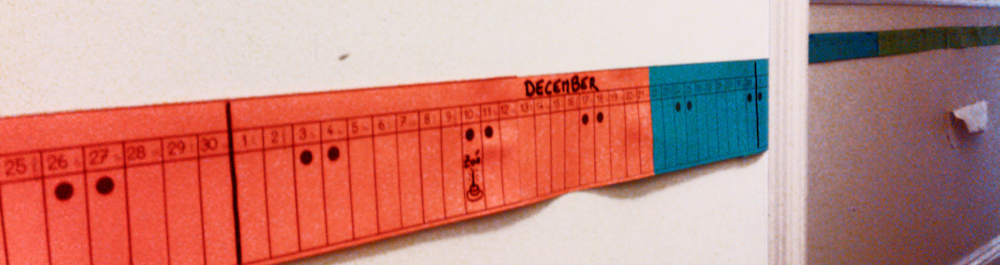

Poutre du Temps
===============




Script Python et template SVG pour créer une poutre du temps.

Qu'est-ce qu'une poutre du temps ?
----------------------------------

Une poutre du temps est une sorte d'agenda familial, imprimé sur papier et collé
au mur. La poutre représente une année, et est particulièrement utile pour aider
les enfants à se repérer dans le temps.

Préparation
-----------

1. Générer la poutre en exécutant le script Python:

```
$ python generate.py
```

Le script crée 7 fichiers SVG, qui contiennent tous les jours d'une année
complète, en commençant au lendemain du jour d'exécution du script.

Si vous ne voulez pas générer vous même les fichiers, **la poutre pour septembre 2016 à août 2017 est disponible dans [le dossier
generated/](generated).**

2. astuce: si Inkscape est installé, vous pouvez simplement convertir les
   fichiers `svg` en `pdf` avec la commande suivante, à exécuter dans un
   terminal:

```sh
for i in page*.svg; do inkscape --export-pdf ${i%.svg}.pdf $i;done`
```

3. Imprimer les 7 fichiers (attention à imprimer en mode 'sans marges'), découper les bandes (3 par page), et les assembler.

4. Si vous le souhaitez, vous pouvez utiliser une couleur de papier différente pour chaque
   saison (par exemple, vert, jaune, orange, bleu).

Voilà !


